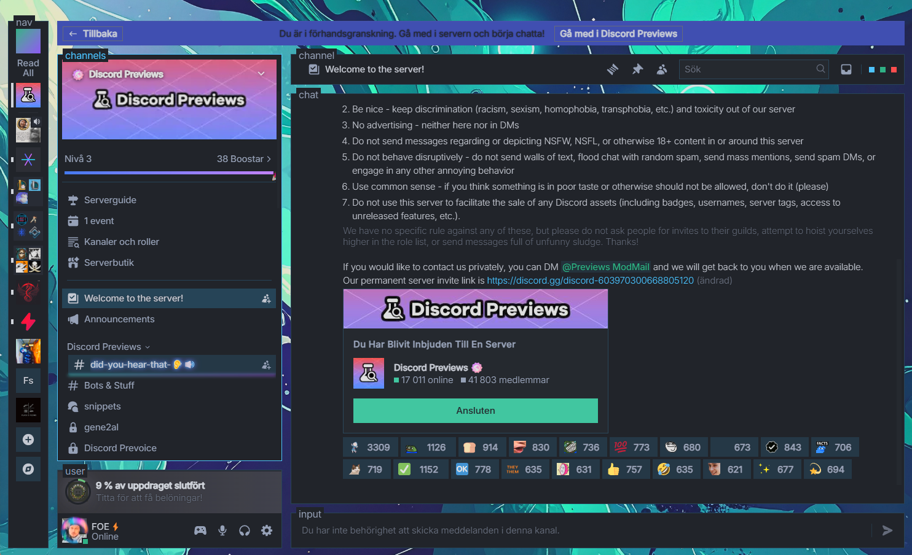

# System24 (Neon Abyss)



A breathtaking dark cyberpunk-inspired Discord theme with a vibrant neon palette, elegant typography, and dynamic glowing effects. Designed to enhance your Discord experience with a futuristic aesthetic. This theme is based on the original [System24 theme by refact0r](https://github.com/refact0r/system24), customized and enhanced with my own style by FoeXploit.

## Features
- **Cyberpunk Aesthetic**: Dark backgrounds with vibrant neon accents (green, blue, purple).
- **Dynamic Effects**: Neon glows, hover animations, and gradient transitions for an immersive experience.
- **Elegant Typography**: Uses `Inter` for body text and `JetBrains Mono` for code snippets.
- **Customizable**: Easily adjust the background image and accent colors to match your style.
- **Optimized Readability**: High contrast text with shadows for clarity on vibrant backgrounds.

## Installation

### Prerequisites
- Install the [Vencord](https://vencord.dev/) Discord client modification tool.
- Ensure you have a background image URL ready (this theme uses `https://raw.githubusercontent.com/FoeXploit/vencord-theme-neon-abyss/refs/heads/main/assets/bg.jpg` by default).

### Steps
1. **Download the Theme**:
   - Clone this repository or download the `theme/system24-neon-abyss.theme.css` file:
     ```bash
     git clone https://github.com/FoeXploit/system24-neon-abyss.git
